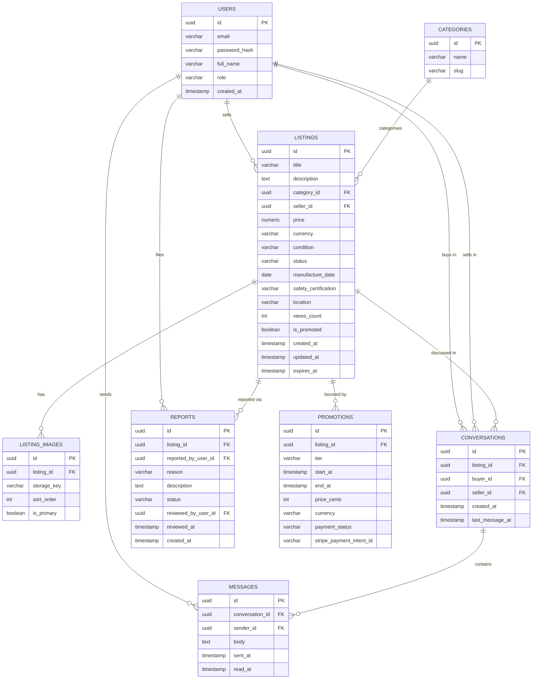

# AlpineGearHub

A niche C2C marketplace for climbing and mountaineering gear — safety-aware listings, real-time buyer↔seller chat, community moderation, and paid listing promotions.


## Stack

| Layer    | Technology |
|----------|-----------|
| Frontend | React 19, TypeScript, Vite, Tailwind CSS 4, TanStack Query 5, React Hook Form, Zod |
| Backend  | .NET 10, ASP.NET Core Web API, EF Core 10, MediatR, FluentValidation, SignalR |
| Database | PostgreSQL 18 |
| Cache    | Redis |
| Storage  | MinIO (S3-compatible, local) / AWS S3 (production)¹ |
| Payments | Stripe (test mode) |
| Auth     | JWT Bearer tokens + refresh tokens, ASP.NET Core Identity (password hashing) |
| Tests    | xUnit + Testcontainers (backend), Vitest + Testing Library (frontend) |
| CI       | GitHub Actions |

¹ `MinioFileStorage` talks to the real AWS S3 SDK (`IAmazonS3`), just pointed at a local MinIO
endpoint — so swapping in AWS credentials and dropping the endpoint override is enough for the
upload/download path to work against real S3 as-is. The one thing that's dev-only and shouldn't
run against production is `EnsureStorageBucketExistsAsync`, which auto-creates the bucket with a
public-read policy on startup; a production bucket should be provisioned separately (IaC) with a
tighter access policy (e.g. CloudFront + presigned URLs) instead of world-readable objects.

## Architecture

The backend is a **modular monolith** — one deployable process, but the codebase is sliced vertically by business capability. Each module (`Identity`, `Listings`, `Chat`, `Moderation`, `Promotions`) is internally structured as **Clean Architecture** with Domain / Application / Infrastructure layers. Modules communicate exclusively through domain events and explicit contracts — never by referencing each other's infrastructure or domain layer directly.

Each module owns a separate PostgreSQL schema (`identity`, `listings`, `chat`, `moderation`, `promotions`), enforcing the modular boundary at the database level without requiring a separate database per module.

Design principles applied throughout: **DDD** (aggregate roots, value objects, domain events), **SOLID** (one handler per command/query, interface-driven dependencies, no god-services).

## Features

- **Listings** — create, edit, and browse gear for sale with category, condition, price, location, manufacture date, and safety certification fields (e.g. CE EN 892, UIAA 101)
- **Listing state machine** — `Draft → Active → Reserved → Sold` / `Active → Expired → Active` (renew) / `Active → Removed` (moderation only)
- **Categories** — Ropes, Harnesses, Helmets, Crampons, Ice Axes, Carabiners, Backpacks, Tents, Boots
- **Search & filtering** — filter by category, price range, condition, location; full-text search; pagination
- **Image upload** — up to 8 photos per listing, stored in MinIO (local) or S3 (production)
- **Real-time chat** — buyer↔seller messaging via SignalR, with full message history
- **Roles** — Member (list and buy), Moderator (act on reports), Admin (full access — categories, users)
- **Reports** — flag listings for Counterfeit, Prohibited, Scam, SafetyConcern, or Other; moderation workflow for Moderators and Admins
- **Promotions** — pay to boost a listing to the top of search results (Stripe test mode)
- **Redis cache** — category list, popular searches, login rate-limiting

## Getting started

### Option A — Docker (recommended)

The entire stack runs with a single command. Only [Docker](https://docs.docker.com/get-docker/) is required.

```bash
git clone https://github.com/Matias014/alpine-gear-hub.git
cd alpine-gear-hub
docker compose up --build
```

| Service   | URL                            | Credentials |
|-----------|--------------------------------|-------------|
| App       | http://localhost:3000          | see below |
| API       | http://localhost:8080          | — |
| Swagger   | http://localhost:8080/swagger  | — |
| MinIO     | http://localhost:9001          | user: `minioadmin` / pass: `minioadmin` |
| pgAdmin   | http://localhost:5050          | email: `admin@alpinegearhub.local` / pass: `admin` |

Migrations are applied automatically on first start. The seed admin account is **development-only** (`ASPNETCORE_ENVIRONMENT=Development`, which is what both `docker compose up` and `dotnet run` use here) — a real deployment needs its own admin bootstrap instead of a well-known default login.

**Demo accounts**

Run `./scripts/seed-demo-listings.sh` once the backend is up to populate the marketplace and create these accounts (see [Seeding demo listings](#seeding-demo-listings-optional) below):

| Role | Name | Email | Password |
|------|------|-------|----------|
| Admin | System Admin | `admin@alpinegearhub.local` | `Admin1234!` |
| Seller | Alex Sterling | `alex.sterling@alpinegearhub.local` | `Demo1234!` |
| Seller | Mia Larsen | `mia.larsen@alpinegearhub.local` | `Demo1234!` |
| Seller | Sam Rivera | `sam.rivera@alpinegearhub.local` | `Demo1234!` |

The admin account is seeded automatically; the three seller accounts only exist after running the seed script. Since each owns a different set of listings, you can log in as one seller and message/report another seller's listing to see the buyer-side flows too.

To override secrets (JWT key, Stripe test key, etc.):

```bash
cp .env.example .env   # then edit .env
docker compose up --build
```

---

### Option B — Manual setup (for development)

**Prerequisites:** [.NET 10 SDK](https://dotnet.microsoft.com/download), [Node.js 22+](https://nodejs.org/), [Docker](https://docs.docker.com/get-docker/) (for PostgreSQL, Redis, MinIO)

**1 — Start infrastructure**

```bash
docker compose up -d postgres redis minio
```

**2 — Run the backend**

```bash
cd backend
dotnet run --project src/Host/AlpineGearHub.Api
```

The API starts on **http://localhost:8080**. Migrations and the default admin account are applied automatically.  
Swagger UI is available at **http://localhost:8080/swagger**.

**3 — Run the frontend**

```bash
cd frontend
npm install
npm run dev
```

The app opens at **http://localhost:5173**.

### Seeding demo listings (optional)

To populate the marketplace with 10 published listings (one per category, each with a photo) instead of starting from an empty database, run this once the backend is up:

```bash
./scripts/seed-demo-listings.sh
```

It registers the 3 seller accounts listed above (Alex Sterling, Mia Larsen, Sam Rivera — password `Demo1234!` for all), splits the 10 listings across them, and uploads the images in `scripts/seed-images/`. Safe to re-run — it registers the same accounts again (a no-op) but creates a fresh batch of listings each time, so re-running it repeatedly will leave you with duplicates.

## Running tests

**Backend** (integration tests, requires Docker):

```bash
cd backend
dotnet test
```

**Frontend** (unit tests):

```bash
cd frontend
npm test
```

## Database schema


